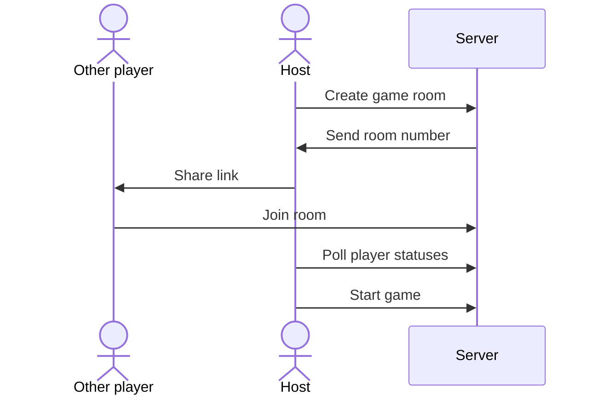
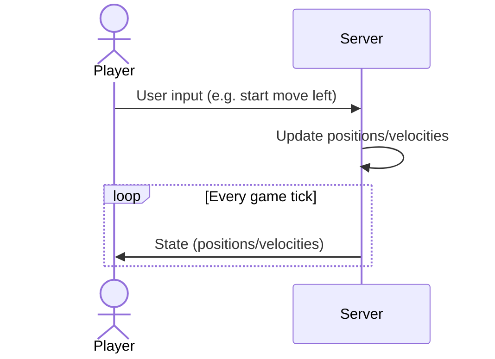

# maze-game
A game about mazes.

## What is this?
This is a toy project to learn about more about real time multiplayer games. Right now there is no game objective, there is just a game state sync so that players can see each other's movement in a 2D maze.

## Overview
Below are two [Mermaid](https://mermaid-js.github.io/mermaid/#/) diagrams that explain the user and server interactions briefly.

### Preparing the game

### Gameplay

## Implementation

### Server
The server is authoritative and makes sure players move with the right velocities and not through walls. Players can only send actions like "start moving left" and the server computes the resulting positions.

Game state is stored in memory. One way to scale this without adding external storage would be to have a load balancer that picks a node based on game ID.

### Client
The client has some trade-offs to balance smooth gameplay with the true server state.

The current player moves based on the latest received velocity, but will adjust its position if the difference with server state becomes too large. There is some delay between user input and new velocity, but the benefit is that there are fewer adjustments than if the player moves too freely.

The simulated other players lag behind a little and move only based on the position from the server. One of the benefits of this is that they don't need client side collision detection. They can simply be ghosts that are slightly delayed, but with valid positions.